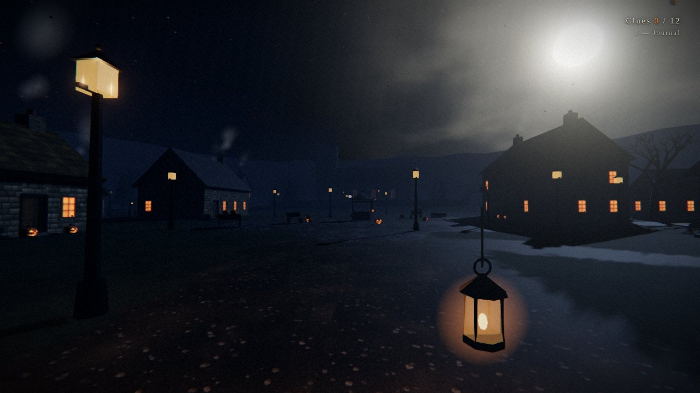
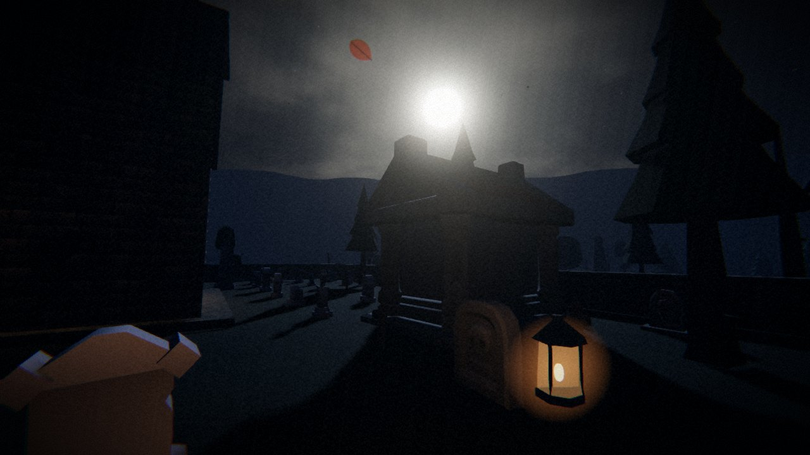

# Ashcombe Hollow

*All Hallows' Eve, in a small village in Somerset that keeps early hours.*

A spooky first-person mystery for the browser, built with [three.js](https://threejs.org). You arrive after dark in the village of Ashcombe on the strength of a letter from a great-aunt you never knew you had. Every window is lit, every doorstep has a pumpkin on it, and there is nobody about. Explore the village, read what the villagers left behind, and work out what the Vigil is before the church clock strikes eleven.



## Play it

The game is a static site with no build step.

**Online:** enable GitHub Pages for this repository (Settings → Pages → *Deploy from a branch*, root folder) and open the published URL.

**Locally:** serve the folder over HTTP (ES modules will not load from `file://`):

```bash
# any static server works, for example:
npx serve .            # then open http://localhost:3000
# or
python3 -m http.server 8000   # then open http://localhost:8000
```

Works on a desktop browser with a mouse and keyboard, and on a phone or tablet held in landscape. Headphones recommended.

## Controls

| Key | Action |
| --- | --- |
| `W A S D` / arrows | Walk |
| `Shift` | Run |
| Mouse | Look |
| `E` | Examine, read, open doors |
| `J` / `Tab` | Journal and map |
| `Esc` | Pause (mouse sensitivity, head-bob) |

On a touch screen, hold the device in landscape (a card asks you to turn it if you don't):

| Touch | Action |
| --- | --- |
| Left thumb, anywhere | A stick appears where you press — drag to walk |
| Push the stick to the edge | Run |
| Drag on the right | Look |
| Tap on the right, or **EXAMINE** | Examine, read, open doors |
| **JOURNAL** | Journal and map |
| **❚❚** | Pause |
| Tap the paper or the book | Put it down |

The **Quality** selector on the title screen trades shadows, bloom and anti-aliasing for frame rate on weaker machines. Phones start on *Low* and tablets on *Medium*; if the frame rate still drags, the game quietly sheds effects on its own rather than crawling (`?nodowngrade` turns that off).



## What's in the village

- A procedurally generated English village: thatched and slate-roofed cottages, a brick coaching inn, a stone schoolhouse, the vicarage, a Norman church with a bell tower and a full churchyard, dry-stone walls, a village green with a well, a field of scarecrows, a marsh with a stone circle, and woods all round.
- Five buildings you can walk into, each dressed with furniture, firelight and the things their occupants left behind.
- Twelve clues that assemble into the story of the Vigil, a journal that keeps track of what you have worked out, and a hand-drawn map.
- Two endings, decided by what you choose to do when the bell rings.
- Something tall that stands at the end of lanes and is closer each time you look back.
- A fully procedural soundscape: wind, owls, crows, footsteps that change with the ground, creaking doors, the church bell, whispers from the marsh and your own heartbeat. No audio files.
- The buildings, terrain, sky, water and every texture are generated at load time in code. The woods, churchyard and clutter use CC0 low-poly models from the KayKit Halloween Bits pack and Kenney's Graveyard, Nature and Survival kits (see `THIRD_PARTY_LICENSES.md`), recoloured for moonlight and batched into a handful of draw calls.

## Technical notes

- `index.html` loads `src/main.js` as an ES module. three.js r185 is vendored in `vendor/three` (MIT licence, see `vendor/three/LICENSE`) and resolved through an import map, so nothing needs installing.
- Rendering: `WebGLRenderer` with ACES tone mapping, moon-lit directional shadows, a pool of point lights assigned each frame to the nearest lanterns and candles, `UnrealBloomPass`, a custom colour-grade / grain / vignette pass and FXAA.
- World: a height-field terrain with a three-way splat shader (grass, mud, cobbles), a custom sky shader (stars, clouds, an oversized moon and a dawn), a shader-driven marsh, wind-swayed reeds, instanced procedural trees, ground mist, falling leaves, chimney smoke, wisps and bats.
- Static geometry is merged by material into spatial chunks after the village is built, which keeps draw calls manageable.
- `src/world/assets.js` is the model library: a manifest of CC0 glTF files with target sizes and collider shapes, a loader that flattens each file into plain meshes with shared materials, and helpers to place or instance them. `dev/catalogue.html` renders every model in the manifest for inspection.
- `src/touch.js` is the on-screen control layer: a floating thumb-stick, a look-drag zone and the buttons. It feeds virtual key presses and analogue axes into the ordinary `Input` object, so the player, interaction and story code never learn whether a mouse or a thumb is driving them.
- `src/story.js` holds all of the clue text and the act structure; `src/world/village.js` is the village layout.

### Developer flags

Append these to the URL for testing (`noassets` builds the fully procedural village without the model packs):

- `?debug` skips the title screen and starts immediately (add `&x=..&z=..&yaw=..` to spawn somewhere specific).
- `?debug&act=3` starts with the bell already rung.
- `?q=low|medium|high` forces a quality level; `&ts=4` (with `debug`) speeds up game time.

`window.__game` exposes the running game for poking at from the console.

## Credits

Written for Halloween 2026. Built with three.js. Fonts by the IM Fell and Caveat projects via Google Fonts (the game falls back to system fonts offline).
